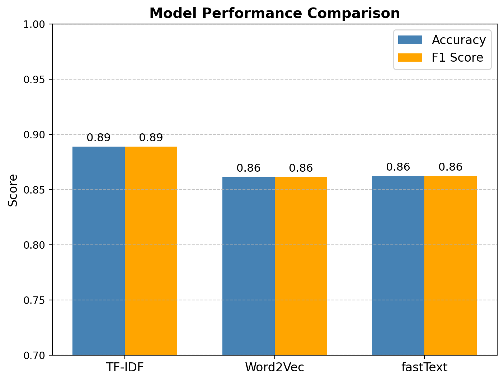

# NLP Coursework – Sentiment Analysis on IMDb Reviews 🎬

This repository contains my submission for **Natural Language Processing Coursework** at NSBM Green University.

## 📌 Task
- **Dataset:** IMDb Movie Reviews (50,000 reviews)
- **NLP Task:** Sentiment Analysis (positive/negative classification)

## ⚙️ Pipeline
1. **Preprocessing:** tokenization, stopword removal, lemmatization  
2. **Feature Extraction:** TF-IDF, Word2Vec, fastText  
3. **Models:** Logistic Regression, SVM  
4. **Evaluation:** Accuracy, F1, Confusion Matrix, ROC Curves, Learning Curve  
5. **Visualization:** t-SNE of embeddings, performance comparison charts  

## 📊 Results
| Model            | Accuracy | F1-macro |
|------------------|----------|----------|
| TF-IDF (LogReg)  | 0.889    | 0.889    |
| TF-IDF (SVM)     | 0.886    | 0.886    |
| Word2Vec         | 0.861    | 0.861    |
| fastText         | 0.862    | 0.862    |



## 📂 Repository Structure
- `notebook/` → Jupyter notebook with full code  
- `report/` → Coursework report (PDF, max 8 pages)  
- `slides/` → Presentation slides (4–6)  
- `figs/` → Figures used in the report  

## ▶️ How to Run
```bash
git clone https://github.com/<your-username>/nlp-coursework.git
cd nlp-coursework
pip install -r requirements.txt
jupyter notebook notebook/nlp_sentiment.ipynb
